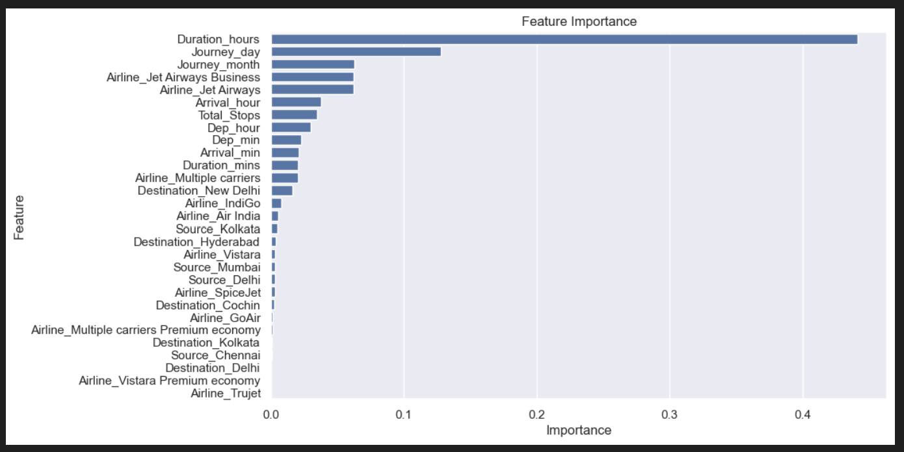

# Flight Price Prediction

A Machine Learning project that predicts airline ticket prices using historical flight data. The project includes data preprocessing, feature engineering, model training, and evaluation using regression algorithms.

## Features

* Data Cleaning and Preprocessing
* Feature Engineering
* Exploratory Data Analysis (EDA)
* Model Training and Evaluation
* Flight Fare Prediction

## Tech Stack

* Python
* Pandas
* NumPy
* Scikit-Learn
* Matplotlib
* Seaborn

## Machine Learning Workflow

Data Collection → Data Cleaning → Feature Engineering → Model Training → Model Evaluation → Price Prediction

## Evaluation Metrics

* Mean Absolute Error (MAE)
* Mean Squared Error (MSE)
* Root Mean Squared Error (RMSE)

## Key Learning Outcomes

* Regression Modeling
* Feature Engineering
* Data Preprocessing
* Model Evaluation Techniques

## Feature Importance

